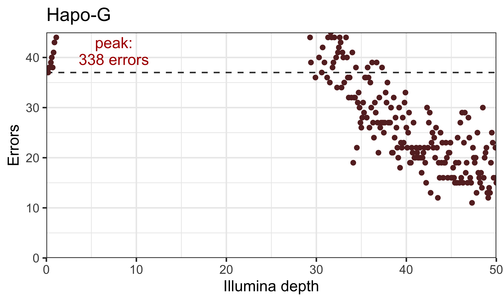
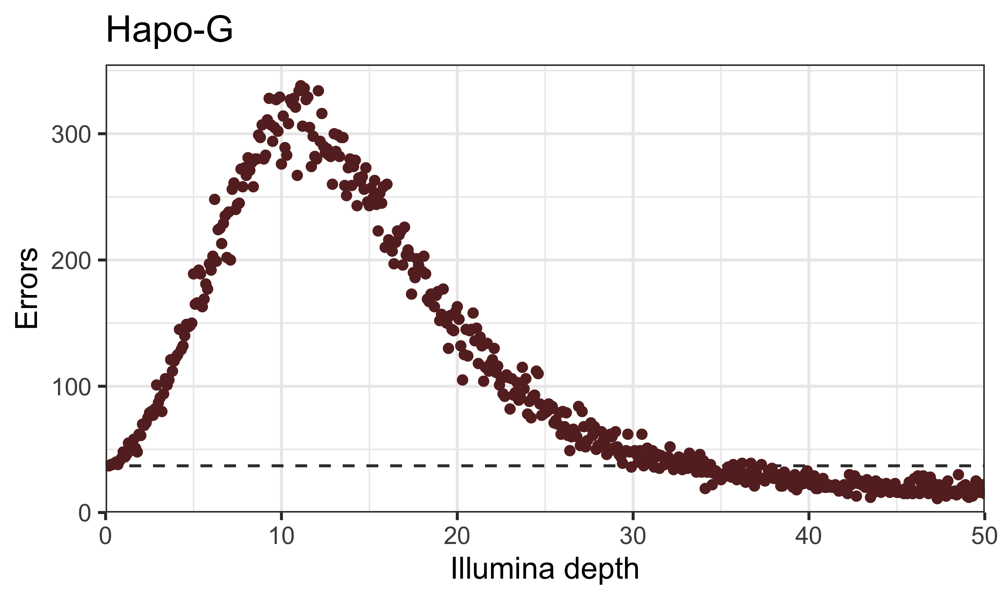
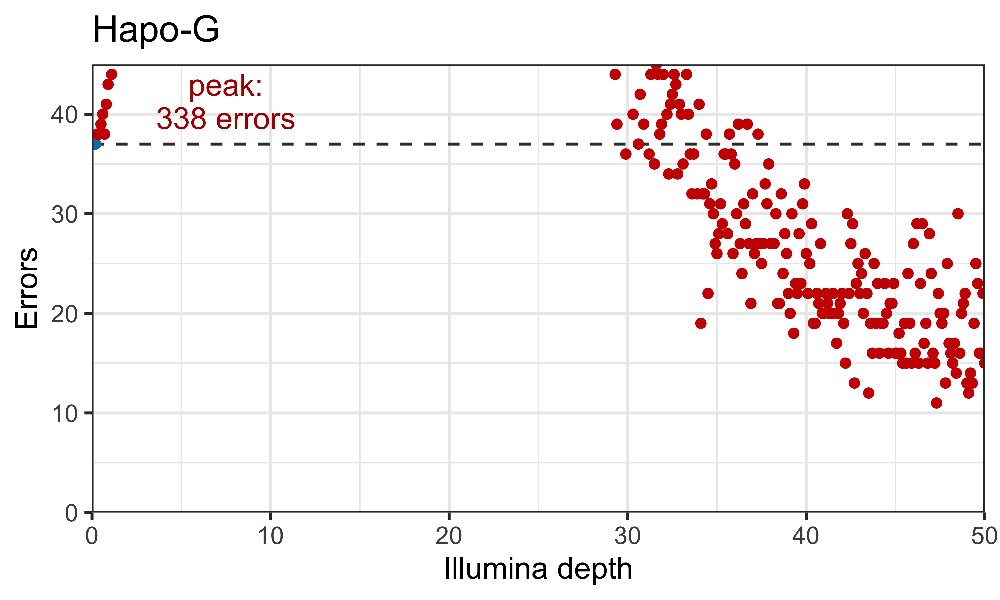
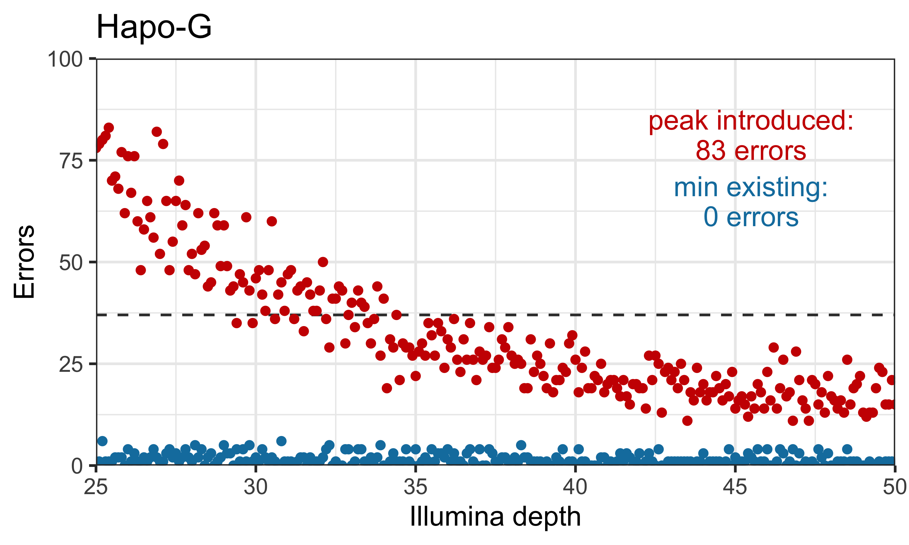
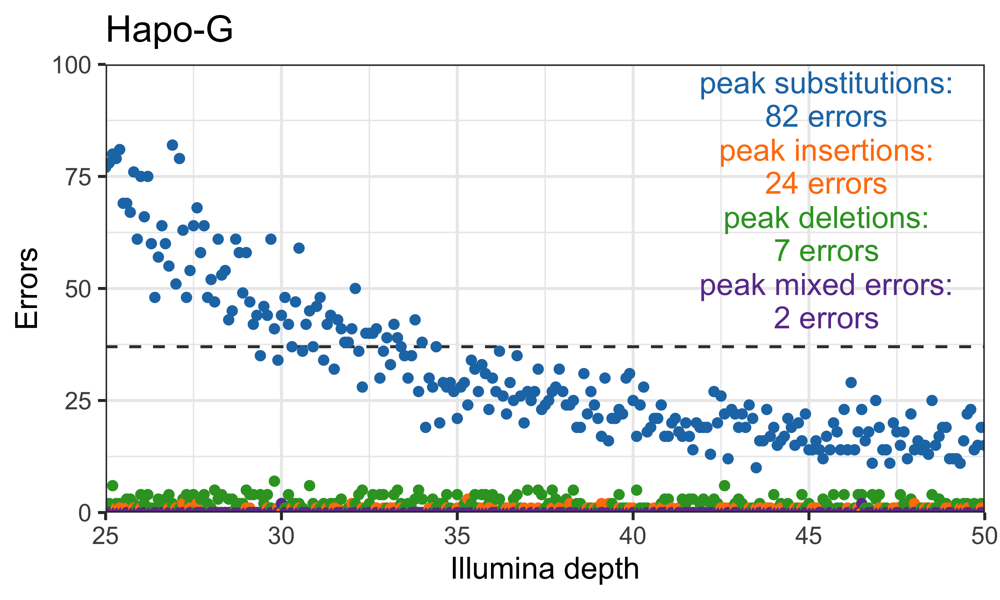

We weren't aware of [Hapo-G](https://github.com/institut-de-genomique/HAPO-G) when preparing the manuscript and so failed to include it. After the manuscript was published, we ran Hapo-G though our main analysis and error characterisation pipelines. Below are additional figure panels with Hapo-G results (can be compared to the other polishers in the [manuscript's figures](https://github.com/gbouras13/depth_vs_polishing_analysis/tree/main/figures)).

Hapo-G tended to introduce substitution errors during polishing and overall performed similarly to HyPo. These new results therefore do not change any of the conclusions of the manuscript.

 

---

 

**Figure 2: total errors by depth per polisher.** Each plot shows the total number of errors remaining in the nine reference genomes at each interval from 0.1–50× depth (x-axis) for the eight polishers tested. The dashed lines represent the total Trycycler ONT-only assembly error count of 37 errors. Points above this line indicate that the polisher decreased total accuracy while points below the line indicate increased total accuracy. The y-axes for the plots are limited at 45 total errors, with the peak error count labelled in the top left if it exceeds 45. See Figure S2 for the plots with unrestricted y-axes.

 

---

 

**Figure S2: total errors by depth per polisher with unrestricted y-axes.** This figure contains the same data as Figure 2 but with full range on the y-axes.

 

---

 

**Figure S3: total errors by depth per polisher coloured where accuracy is decreased in at least one sample.** This figure is the same as Figure 2 but with additional information shown in the colour of the points. Red points indicate all intervals where there were more total errors compared to the Trycycler baseline in at least one out of the nine genomes tested. Blue points indicate intervals where there all nine polished genomes had equal or fewer errors than the Trycycler assemblies.

 

---

 

**Figure S5: total introduced and existing errors by depth (25–50×).** Each plot shows the total number of introduced (red) and existing (blue) errors remaining in the nine reference genomes at each sufficient depth interval from 25–50× (x-axis) for each polisher tested. The dashed lines represent the total Trycycler ONT-only assembly error count of 37 errors. Existing errors consist of the original 37 errors, while introduced errors are introduced by polishing.

 

---

 

**Figure S6: total substitution, insertion, deletion and mixed errors by depth (25–50×).** Each plot shows the total number of substitutions (blue), insertions (orange), deletions (green) and mixed errors (purple) remaining in the nine reference genomes at each sufficient depth interval from 25–50× (x-axis) for each polisher tested. Mixed errors indicate errors where there is a mixture of substitutions, insertions and/or deletions in the same genomic region. The dashed lines represent the total Trycycler ONT-only assembly error count of 37 errors.
